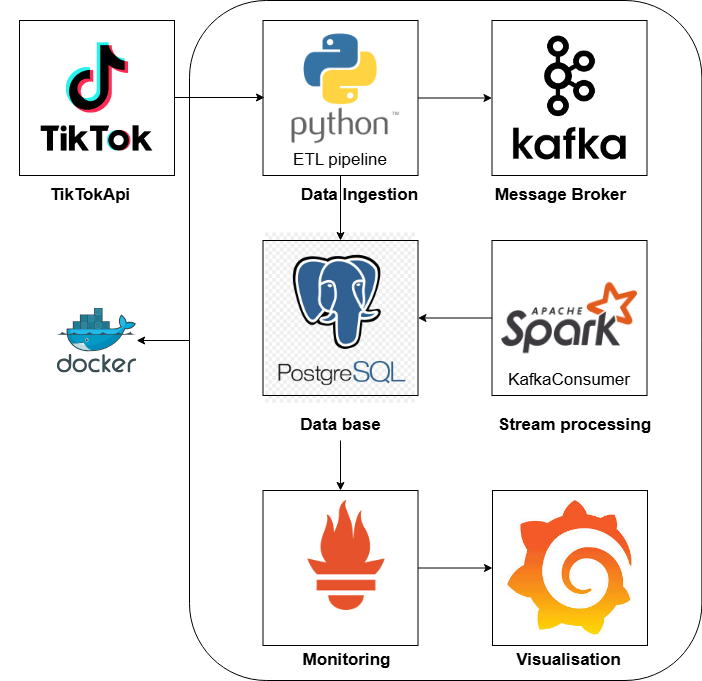

# TikTok Data ETL Pipeline

ETL-система для сбора, обработки и анализа данных из TikTok. Система извлекает данные с помощью API TikTok, сохраняет их в PostgreSQL и обрабатывает в реальном времени с использованием Apache Kafka и Spark Streaming.

## Основные возможности

**Сбор данных о пользователях и видео из TikTok**
- Параллельное выполнение запросов для повышения производительности
- Кеширование токенов аутентификации в .env файле
- Обработка ограничений API (rate limits, ошибки 429, 503)

**Потоковая обработка данных в реальном времени**
- События от Kafka-Producer -> Kafka -> Spark Streaming
- Расчет метрик вовлеченности и популярности контента
- Агрегирование данных по временным интервалам

**Хранение и аналитика**
- Автоматическое сохранение данных в PostgreSQL
- Партиционированные таблицы для эффективного хранения временных рядов
- Оптимизированные запросы для аналитики

## Обзор компонентов

Проект содержит два основных процесса:

1. **`make run-etl`**: Основной ETL-процесс для извлечения данных из TikTok
   - Запускает `src/etl_pipeline.py` 
   - Собирает данные о пользователях и видео через TikTok API
   - Сохраняет в PostgreSQL
   - Отправляет данные в Kafka

2. **`make run-stream`**: Потоковая обработка данных
   - Запуск `src/kafka_consumer.py`
   - Читает данные из Kafka
   - Обрабатывает их в реальном времени через Spark Streaming
   - Вычисляет метрики вовлеченности

## Требования

- Python 3.8+
- PostgreSQL
- Kafka
- Docker и Docker Compose (для запуска инфраструктуры)
- Playwright с Chromium (устанавливается автоматически)

### Установка необходимых компонентов в Ubuntu:
```bash
# Установка Docker и Docker Compose (если не установлены)
sudo apt update
sudo apt install docker.io docker-compose

# Установка PostgreSQL клиента
sudo apt install postgresql-client
```

## Установка

1. Клонировать репозиторий
2. Установить зависимости:
```bash
make setup
```

## Конфигурация

```
mv .env.templates .env
```

Настройки приложения хранятся в файле `.env`:

```
# TikTok API Credentials
# MS_TOKEN=your_ms_token_here
# TIKTOK_VERIFY_FP=your_verify_fp_here
# TIKTOK_SESSIONID=your_sessionid_here

# Database Configuration
DB_HOST=localhost
DB_PORT=5432
DB_NAME=tiktok_data
DB_USER=postgres
DB_PASSWORD=postgres

# Kafka Configuration
KAFKA_BOOTSTRAP_SERVERS=localhost:9092
KAFKA_TOPIC=tiktok-data

# Monitoring
PROMETHEUS_PORT=8001

# ETL Configuration
ETL_SCHEDULE_INTERVAL=60  # Minutes
ETL_RETRY_COUNT=3
ETL_RETRY_DELAY=5  # Seconds

# Target TikTok Accounts (comma-separated list of usernames)
TARGET_ACCOUNTS=obschestvoznaika_el,himichka_el,anglichanka_el,fizik_el,katya_matematichka

# Target account URLs (JSON format)
TARGET_ACCOUNT_URLS={"obschestvoznaika_el":"https://www.tiktok.com/@obschestvoznaika_el?_t=ZS-8s811wf5v9R&_r=1",...}
```

## Получение токенов аутентификации TikTok

Автоматическое кеширование токенов аутентификации TikTok:

```bash
# Запуск скрипта для получения токенов
python get_tokens.py your_tiktok_username your_tiktok_password

# Запуск в фоновом режиме (без отображения браузера)
python get_tokens.py your_tiktok_username your_tiktok_password --headless
```

Скрипт автоматически:
1. Запустит браузер и авторизуется в TikTok
2. Извлечет необходимые токены из cookies
3. Обновит файл .env с новыми токенами
4. Сохранит скриншот для проверки авторизации

**Примечание**: Если включена капча или двухфакторная аутентификация, скрипт будет ждать ручного завершиения процесса авторизации в открывшемся окне браузера.

## Запуск системы

1. **Инициализация проекта**:
   ```bash
   # Полная установка (зависимости, Playwright, база данных)
   make setup
   
   # Запуск инфраструктуры
   make docker-up

   # Инициализация БД
   make db-init
   ```

2. **Запуск ETL (в одном терминале)**:

   ```bash
   # Миграция схемы БД
   make db-migrate
   ```

3. **Запуск ETL (в одном терминале)**

   ```bash
   # Однократный запуск
   make run-etl

   # Запуск с расписанием (каждый час)
   python src/etl_pipeline.py --schedule
   ```

3. **Запуск потоковой обработки (в другом терминале)**:
   ```bash
   make run-stream
   ```

4. **Завершение работы**:
   ```bash
   # Остановка инфраструктуры
   make docker-down
   ```

## Технические особенности реализации

### Параллельные запросы к API

Для повышения производительности система использует асинхронный подход с параллельным выполнением запросов:

```python
async def get_multiple_users_data(self, username_urls, max_workers=2):
    # Process users in batches to limit concurrency
    for i in range(0, len(items), max_workers):
        batch = items[i:i + max_workers]
        # Create tasks for the current batch of users
        tasks = [process_user(username, url) for username, url in batch]
        # Execute batch in parallel
        batch_results = await asyncio.gather(*tasks)
```

Количество одновременных запросов регулируется параметром `max_workers`, что позволяет настраивать баланс между скоростью и нагрузкой на API.

### Обработка ограничений API

Система включает встроенные механизмы обработки ограничений API:

1. **Автоматические повторные попытки** при ошибках 429 (Too Many Requests) и 503 (Service Unavailable)
2. **Экспоненциальная отсрочка** между повторными попытками
3. **Случайный jitter** для предотвращения «громких соседей»
4. **Отслеживание ошибок** через метрики Prometheus

```python
if "too many requests" in error_message or "429" in error_message:
    wait_time = int(self.retry_delay * (2 ** retries))
    logger.warning(f"Rate limit hit. Waiting {wait_time} seconds")
    await asyncio.sleep(wait_time)
    return await self._make_request_with_retry(operation, *args, retries=retries+1, **kwargs)
```

### Кеширование токенов аутентификации

Токены аутентификации TikTok автоматически кешируются в .env файле через утилиту `token_extractor.py`. Это позволяет:

1. **Повысить стабильность работы**: сохраненные токены используются автоматически при перезапуске
2. **Управлять учетными записями**: легко переключаться между разными аккаунтами
3. **Управлять доступом**: хранить чувствительные данные отдельно от кода

## Мониторинг и метрики

- Метрики Prometheus доступны по адресу http://localhost:8001
- Grafana - `http://localhost:3000` (admin/admin)
  - Подключение к Prometheus (localhost:9090)
  - Создайте дашборд для мониторинга метрик из Prometheus

## Архитектура системы



## Структура проекта

- `src/tiktok_api.py` - Клиент API TikTok с поддержкой параллельных запросов
- `src/etl_pipeline.py` - ETL пайплайн
- `src/db_models.py` - Модели данных SQLAlchemy
- `src/kafka_producer.py` - Интеграция с Kafka
- `src/kafka_consumer.py` - Потребитель Kafka для потоковой обработки
- `src/token_extractor.py` - Автоматическое получение токенов TikTok
- `get_tokens.py` - Запуск утилиты для получения токенов
- `migrations/` - SQL-скрипты для инициализации базы данных
- `Makefile` - Команды для работы с проектом